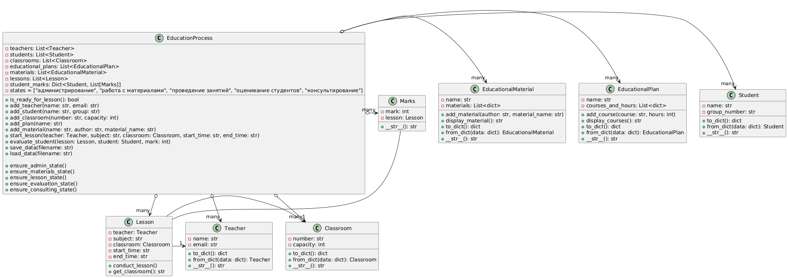
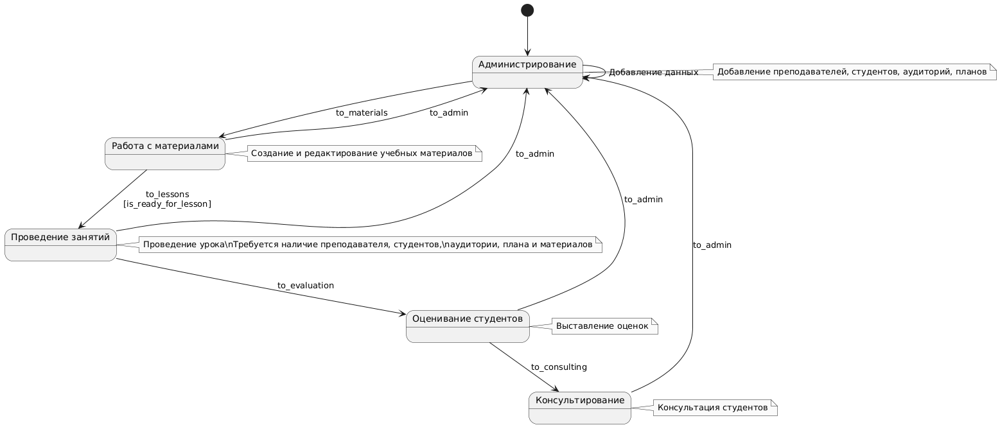

# Модель преподавателя

## Классы 

### Teacher
Класс Teacher предназначен для моделирования и управления информацией о преподавателе
- **Атрибуты**:
    - `name`: ФИО преподавателя
    - `email`: Email
- **Методы**:
    - `to_dict`: Преобразует экземпляр класса в словарь
    - `from_dict`: Создает новый экземпляр класса из словаря
    - `__str__()`: Возвращает информацию о преподователе

### Student
Класс Student предназначен для моделирования и управления информацией о студенте
- **Атрибуты**:
    - `name`: ФИО студента
    - `group_number`: Номер группы
- **Методы**:
    - `to_dict`: Преобразует экземпляр класса в словарь
    - `from_dict`: Создает новый экземпляр класса из словаря
    - `__str__()`: Возвращает информацию о студенте

### Marks
Класс Marks предназначен для моделирования и управления информацией о отметках
- **Атрибуты**:
    - `mark`: Отметка студента
    - `lesson`: Экземпляр класса lesson
- **Методы**:
    - `__str__()`: Возвращает информацию о оценках

### Lesson
Класс Lesson предназначен для моделирования и управления информацией об уроке
- **Атрибуты**:
    - `teacher`: Екземпляр класса Teacher(преподаватель)
    - `subject`: Название предмета
    - `classroom`: Екземпляр класса Classroom(номер аудитории)
    - `start_time`: Начало проведение занятия
    - `end_time`: Конец проведения занятия
- **Методы**:
    - `to_dict`: Преобразует экземпляр класса в словарь
    - `from_dict`: Создает новый экземпляр класса из словаря
    - `get_classroom`: Возвращает информацию о номере аудитории
    - `conduct_lesson`: Выводит информацию о проведении урока

### Interface
Класс Interface предназначен для управления бизнес-логики
- **Атрибуты**:
    - `teachers`: Список преподователей
    - `students`: Список студентов
    - `classrooms`: Список аудиторий
    - `educational_plans`: Список уччебных планов
    - `materials`: Список материалов
    - `lessons`: Список уроков
    - `student_marks`: Словарь(журнал) отметок
- **Методы**:
    - `is_ready_for_lesson`: Проверка на наличие преподователей, аудитории, материалов для проведения уроков
    - `ensure_admin_state`: Переход в состояние админа
    - `ensure_materials_state`: Переход в состояние работа с материалами
    - `ensure_lesson_state`: Переход в состояние проведение уроков
    - `ensure_evaluation_state`: Переход в состояние оценки студентов
    - `ensure_consulting_state`: Переход в состояние консультации студентов
    - `add_teacher`: Добавление учителя
    - `add_student`: Добавление студента
    - `add_classroom`: Добавление аудитории
    - `add_plan`: Добавление плана
    - `add_material`: Добавление материла
    - `start_lesson`: Старт урока
    - `evaluate_student`: Оценить студентов
    - `consult_student`: Консультация студентов
    - `save_data`: Загрузка из json
    - `load_data`: Выгрузка в json

### EducationPlan
Класс EducationPlan предназначен для моделирования и управления информацией о учебных планах
- **Атрибуты**:
    - `name`: Название учебного плана
    - `courses_and_hours`: Кол-во часов
- **Методы**:
    - `to_dict`: Преобразует экземпляр класса в словарь
    - `from_dict`: Создает новый экземпляр класса из словаря
    - `__str__`: Возвращает информацию о плане
    - `add_course`: Добавление плана
    - `display_courses`: Отображение планов

### EducationlMaterial
Класс EducationlMaterial предназначен для моделирования и управления информацией о учебных материалах
- **Атрибуты**:
    - `name`: Название учебного плана
    - `materials`: Кол-во часов
- **Методы**:
    - `to_dict`: Преобразует экземпляр класса в словарь
    - `from_dict`: Создает новый экземпляр класса из словаря
    - `__str__`: Возвращает информацию о плане
    - `add_material`: Добавление материалов
    - `display_material`: Отображение материалов

### Classroom
Класс Classroom предназначен для моделирования и управления информацией об аудиториях
- **Атрибуты**:
    - `number`: Номер аудитории
    - `capacity`: вместимость аудитории
- **Методы**:
    - `to_dict`: Преобразует экземпляр класса в словарь
    - `from_dict`: Создает новый экземпляр класса из словаря
    - `__str__()`: Возвращает информацию о преподователе

### main()
Файл cli.py предназначен для работы с командами в интерфейсе командной строки

# Диаграммы 

