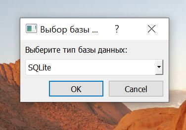
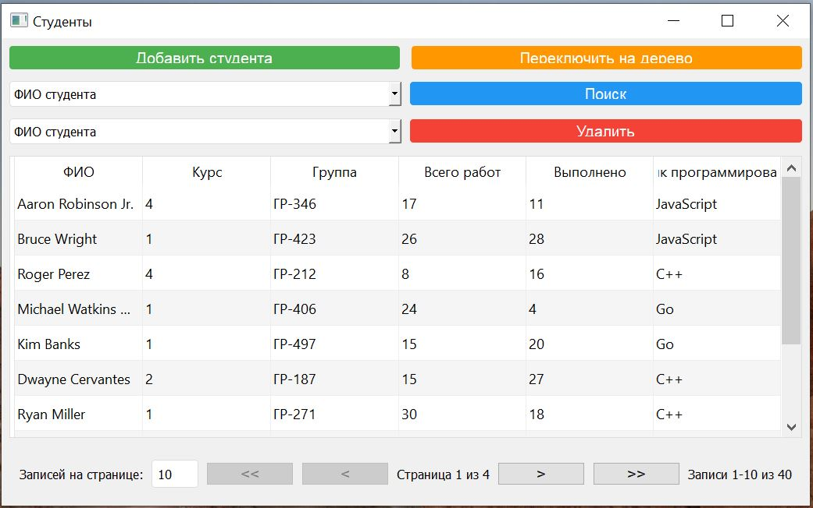
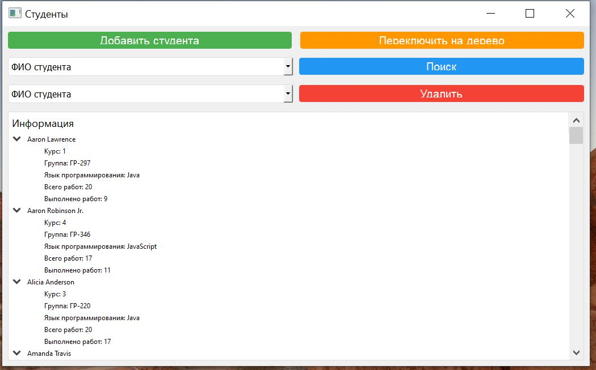
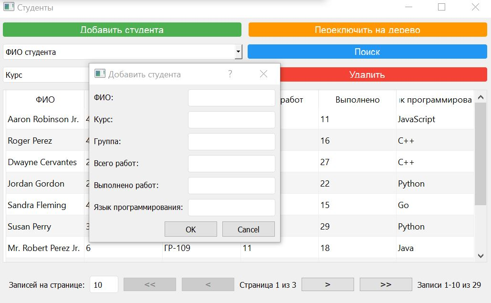
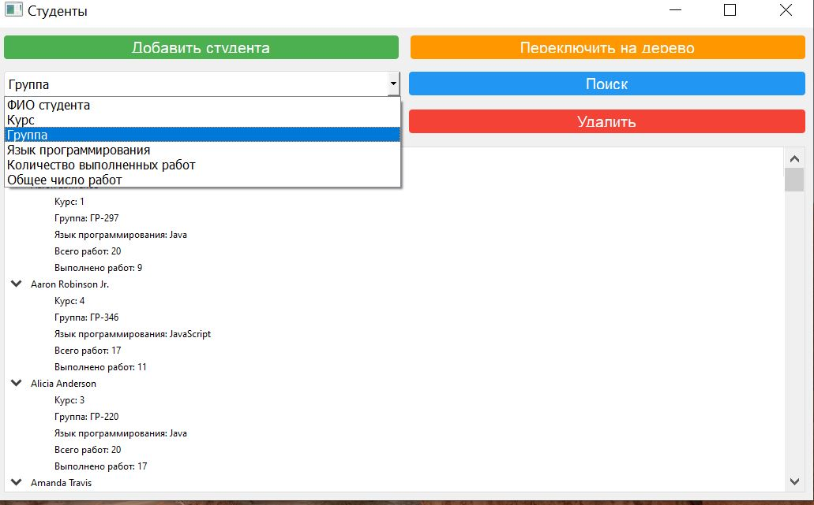
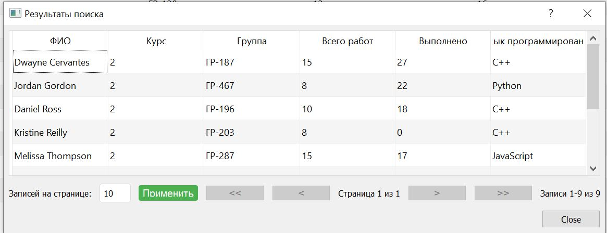
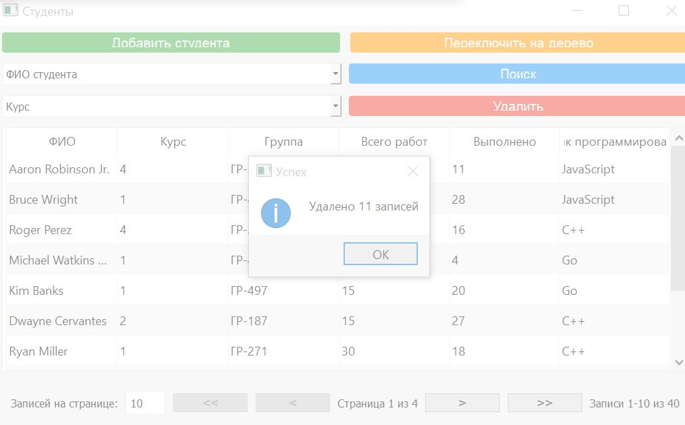

# Лабораторная работа №2

В рамках лабораторной работы №2 была разработана программная система, которая предназначена для управления данными о студентах с помощью графического интерфейса и разлисных моделей хранения.

### Начальное окно
Предоставляется выбор между SQLite и XML

### Главное окно

На главном окне приложения представлена таблица со всей информацией о студентах, оконное меню с возможными действиями добавить, удалить, поиск и панель с перелистыванием страниц и выбором, сколько записей будет на странице:

Так же есть альтернативное представление в виде дерева

### Добавление студента

Можно добавить запись о студенте с помощью отдельного окна, после нажатия на кнопку "Добавить студента":

### Поиск студента

Условия поиска :
- по ФИО студента или группе;
- по курсу или языку программирования;
- по количеству выполненных работ или общему числу работ;

После нажатия на кнопку "Поиск" в новом окне выводятся все студенты, которые удовлетворяют критериям поиска:

### Удаление студентов

Условия удаления :
- по ФИО студента или группе;
- по курсу или языку программирования;
- по количеству выполненных работ или общему числу работ;

После нажатия на кнопку "Удалить" в данном окне появится сообщение о том, сколько записей было удалено

